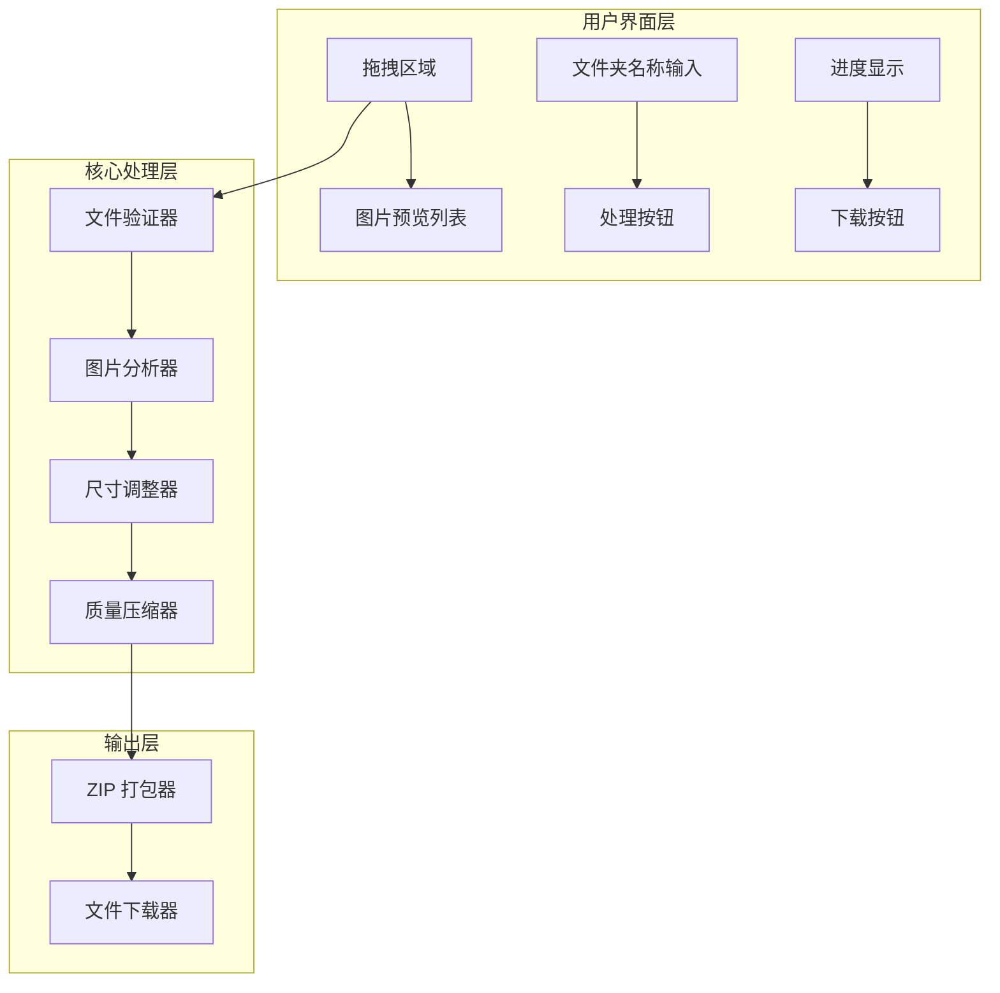

# 设计文档

## 概述

本地网页图片批量处理工具是一个纯前端应用，使用 HTML5、CSS3 和 JavaScript 构建。用户可以通过拖拽方式批量导入图片，系统自动判断并处理图片尺寸和大小，最终打包下载。

## 架构



## 组件和接口

### 1. FileValidator（文件验证器）

负责验证拖拽的文件是否为有效的图片格式。

```typescript
interface FileValidator {
  // 验证文件是否为支持的图片格式
  isValidImageFile(file: File): boolean;
  // 获取支持的文件类型列表
  getSupportedTypes(): string[];
}
```

### 2. ImageAnalyzer（图片分析器）

分析图片属性，判断是否需要处理。

```typescript
interface ImageInfo {
  file: File;
  width: number;
  height: number;
  size: number; // bytes
  needsProcessing: boolean;
  previewUrl: string;
}

interface ImageAnalyzer {
  // 分析图片并返回图片信息
  analyze(file: File): Promise<ImageInfo>;
  // 判断图片是否需要处理
  needsProcessing(info: ImageInfo): boolean;
}
```

### 3. ImageProcessor（图片处理器）

执行图片尺寸调整和压缩。

```typescript
interface ProcessingResult {
  originalFile: File;
  processedBlob: Blob;
  finalWidth: number;
  finalHeight: number;
  finalSize: number;
  wasProcessed: boolean;
}

interface ImageProcessor {
  // 处理单张图片
  process(imageInfo: ImageInfo): Promise<ProcessingResult>;
  // 调整图片尺寸
  resize(image: HTMLImageElement, maxWidth: number, maxHeight: number): HTMLCanvasElement;
  // 压缩图片到指定大小以内
  compress(canvas: HTMLCanvasElement, maxSizeKB: number, format: string): Promise<Blob>;
}
```

### 4. BatchProcessor（批量处理器）

管理批量处理流程和进度。

```typescript
interface BatchProgress {
  total: number;
  completed: number;
  current: string;
  results: ProcessingResult[];
}

interface BatchProcessor {
  // 批量处理所有图片
  processAll(images: ImageInfo[], onProgress: (progress: BatchProgress) => void): Promise<ProcessingResult[]>;
}
```

### 5. ZipExporter（ZIP 导出器）

将处理后的图片打包为 ZIP 文件。

```typescript
interface ZipExporter {
  // 创建包含所有处理后图片的 ZIP 文件
  createZip(results: ProcessingResult[], folderName: string): Promise<Blob>;
  // 触发下载
  download(zipBlob: Blob, fileName: string): void;
}
```

## 数据模型

### ImageFile（图片文件）

```typescript
interface ImageFile {
  id: string;           // 唯一标识符
  file: File;           // 原始文件对象
  name: string;         // 文件名
  type: string;         // MIME 类型
  originalWidth: number;
  originalHeight: number;
  originalSize: number; // bytes
  previewUrl: string;   // 预览 URL
  status: 'pending' | 'analyzing' | 'processing' | 'completed' | 'error' | 'skipped';
  needsProcessing: boolean;
  processedBlob?: Blob;
  finalWidth?: number;
  finalHeight?: number;
  finalSize?: number;
  errorMessage?: string;
}
```

### ProcessingConfig（处理配置）

```typescript
interface ProcessingConfig {
  maxWidth: number;      // 750
  maxHeight: number;     // 750
  maxSizeKB: number;     // 800
  supportedFormats: string[]; // ['image/png', 'image/jpeg']
}
```

### AppState（应用状态）

```typescript
interface AppState {
  images: ImageFile[];
  folderName: string;
  isProcessing: boolean;
  progress: {
    total: number;
    completed: number;
  };
  canDownload: boolean;
}
```


## 正确性属性

*属性是指在系统所有有效执行中都应保持为真的特征或行为——本质上是关于系统应该做什么的形式化陈述。属性是人类可读规范与机器可验证正确性保证之间的桥梁。*

### 属性反思

在分析验收标准后，识别出以下可合并或冗余的属性：
- 2.1 和 2.2 是互补条件，可以合并为一个"处理判断正确性"属性
- 3.1 和 3.2 都是关于尺寸调整和宽高比保持，可以合并
- 6.2 和 6.3 都是关于 ZIP 文件内容，可以合并为一个"ZIP 打包正确性"属性

### 属性 1: 文件格式验证

*对于任意* 文件，当且仅当其 MIME 类型为 image/png、image/jpeg 时，文件验证器应返回 true

**验证: 需求 1.2**

### 属性 2: 处理判断正确性

*对于任意* 图片信息（包含宽度、高度、文件大小），当且仅当宽度 > 750px 或高度 > 750px 或文件大小 > 800KB 时，needsProcessing 应返回 true

**验证: 需求 2.1, 2.2**

### 属性 3: 尺寸调整约束

*对于任意* 需要处理的图片，处理后的宽度应 <= 750px 且高度应 <= 750px，同时保持原始宽高比（误差在 0.01 以内）

**验证: 需求 3.1, 3.2**

### 属性 4: 文件大小约束

*对于任意* 处理后的图片，其文件大小应 <= 800KB

**验证: 需求 4.1**

### 属性 5: ZIP 打包正确性

*对于任意* 处理结果集合和文件夹名称，生成的 ZIP 文件应包含所有处理后的图片，且每个文件保持原始文件名和格式

**验证: 需求 5.3, 6.2, 6.3**

### 属性 6: 批量处理进度一致性

*对于任意* 批量处理过程，每处理完成一张图片，进度计数应增加 1，且最终完成数应等于总数

**验证: 需求 7.2**

## 错误处理

### 文件验证错误
- 非图片文件：显示"不支持的文件格式，请上传 PNG、JPG 或 JPEG 图片"
- 文件读取失败：显示"文件读取失败，请重试"

### 图片处理错误
- 图片加载失败：标记该图片为错误状态，显示"图片加载失败"，继续处理其他图片
- 压缩失败：输出最小可能的文件，显示警告"图片压缩后仍超过 800KB"

### ZIP 打包错误
- 打包失败：显示"打包失败，请重试"
- 下载失败：显示"下载失败，请重试"

## 测试策略

### 单元测试

使用 Jest 进行单元测试，覆盖以下场景：
- FileValidator: 测试各种文件类型的验证
- ImageAnalyzer: 测试 needsProcessing 判断逻辑
- ImageProcessor: 测试尺寸调整和压缩逻辑
- ZipExporter: 测试 ZIP 文件生成

### 属性测试

使用 **fast-check** 库进行属性测试，每个属性测试运行至少 100 次迭代。

属性测试要求：
- 每个属性测试必须使用注释标注对应的正确性属性：`**Feature: image-batch-processor, Property {number}: {property_text}**`
- 每个正确性属性由单独的属性测试实现
- 使用智能生成器约束输入空间

测试覆盖的属性：
1. 文件格式验证 - 生成各种 MIME 类型，验证验证器行为
2. 处理判断正确性 - 生成各种尺寸和大小组合，验证判断逻辑
3. 尺寸调整约束 - 生成各种尺寸的图片，验证处理后满足约束
4. 文件大小约束 - 验证处理后文件大小
5. ZIP 打包正确性 - 验证 ZIP 内容完整性
6. 批量处理进度一致性 - 验证进度更新正确性
